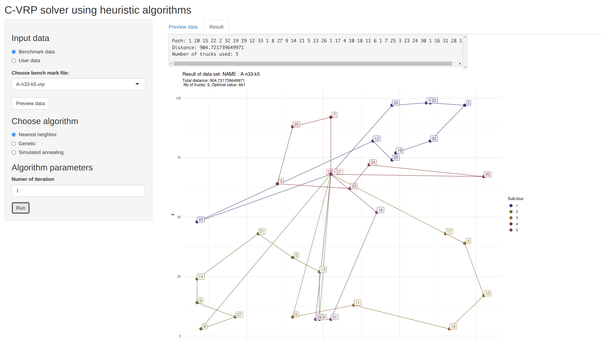

```{r setup, include=FALSE}
knitr::opts_chunk$set(echo = TRUE)
```

## Overview

This is the screenshot from shiny app


This project aim to visualize CVRP (Capacitated Vehicle Routing Problem) with meta heuristic algorithm. There are two algorithm on the app currently: Genetic algorithm and Simulated annealing.

The shiny app is still underdevelopment

## Future work

- [x] Allow user to provide data
- [x] Add user feed back on running progress (NEED HELP)
- [ ] Implement more algorithm: (Tabu search, sweep,...)

## Run app on your machine

If you are interested in this project and want to run it on your machine

```bash
git clone https://github.com/vohai611/cvrp-genetic
cd cvrp-genetic/cvrp-app
Rscript -e "shiny::runApp()"

```
or you can build Docker image with Dockerfile

```bash
git clone https://github.com/vohai611/cvrp-genetic
cd cvrp-genetic/cvrp-app
docker build -t cvrp-app ./ 
docker run --rm -p 3838:3838 cvrp-app
```

**NOTE:** This app require several package to be installed beforehand. Those can be listed using 

```r
renv::dependencies()
```

To install all the package required, use:

```r
renv::restore()
```

Note that, the `GA` package might not compile successfully if your RAM < 1GB, you might try to create swap memory before install it via `renv::restore()`.


