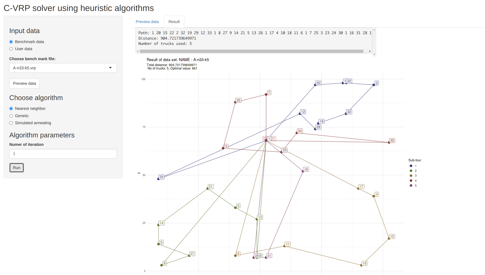

Visualizing vehicle routing problem
================
Hai Vo
10/20/2021

## Overview

This is the screenshot from shiny app


This project aim to visualize CVRP (Capacitated Vehicle Routing Problem)
with meta heuristic algorithm. There are two algorithm on the app
currently: Genetic algorithm and Simulated annealing.

The shiny app is still underdevelopment

## Future work

-   Allow user to provide data
-   Implement more algorithm: (Tabu search, sweep,…)

## Run app on your machine

If you are interested in this project and want to run it on your machine

``` bash
git clone https://github.com/vohai611/cvrp-genetic
cd cvrp-genetic/cvrp-app
Rscript -e "shiny::runApp()"
```

**NOTE:** This app require several package to be installed beforehand.
